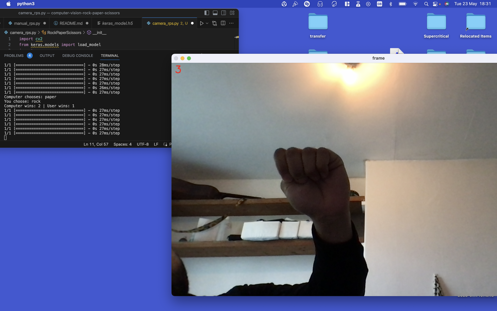

# Computer Vision RPS

The repository contains a keras file generated from Teachable-Machine which contins an image based project that can identify four different image inputs from the webcam. These image states are rock, paper, scissors, and nothing. These inputs are to be used for a game.

manual_rps.py created to simulate the Rock, Paper, Scissors game using four functions:
- The first function, get_computer_choice generates a random choice for the computer.
- The second function, get_user_choice, requires the user to input a choice.
- The third function, get_winner, computes the winner from computer_choice and user_choice.
- The fourth function play runs the game.

camera_rps.py combines RPS-Template.py and manual_rps.py to create a webcam-playable version of Rock, Paper, Scissors. In the camera_rps.py script is:
- A RockPaperScissors Class that defines all of the functions of the game which are listed below;
- An updated get_user_choice function (from manual_rps.py) that incorporates the webcam user input code from RPS-Template.py and to include a countdown for the user to visually input their choice.
- A get_prediction function which converts the output list of probablities of the four different inputs (rock, paper, scissors, nothing) into one of the respective inputs.
- The play function was updated to give a best of three game.

Things to improve would be:
- More training images for the keras_model; there seemed to be a struggle with other hand positions that weren't rock, different lighting for the webcam was trailled however it could be overcome by chosing the Pose training model instead of Image from Teachable Machines
- Options to resize the webcam input window as the window overtook most of Desktop
